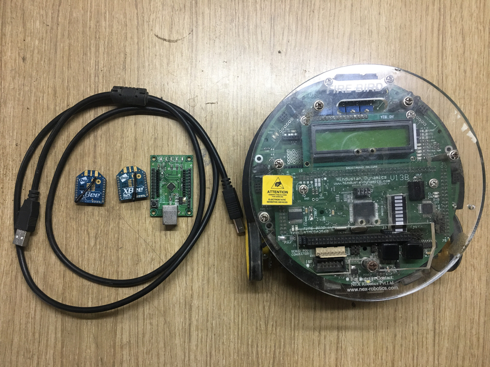
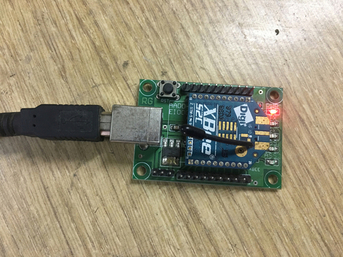
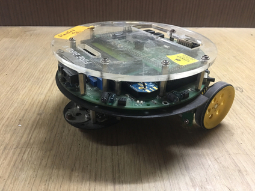

# Gesture Controlled Robot

Majority of implementations for gesture controlled robot use accelerometer where the axis-bends decide the direction of bot.

Here, OpenCV-python is used to recognize hand gestures and pyserail for signal transmission. To keep the focus on hand gesture recognition, communication logic and avoid hardware assembly of bot, a robotic framework FirebirdV robot is used.

>Note:- The code used at bot end can be extended to other Atmega microcontroller since firebirdV uses Atmega2560 at its core. Hence the register and pin configuration will change for other assembled bots.

## Components

 

* **2 Xbee modules** (One for transmission from server and other as reciever at bot)

 

* **Robot** (FirebirdV or SparkV robot. Self assembled robot can also be used.)

 

* **Camera** (In built web-cam or a secondary camera can also be used)

* **System/Raspberry Pi** (Must have Python 3.4+ version)

## Demonstration

  <a href="https://www.youtube.com/watch?v=y6KEIVYK6yc">
     
    Gesture controlled robot
  </a>

